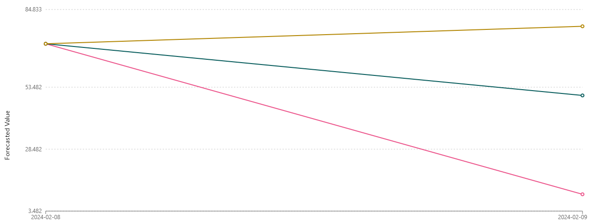

# 📊 Previsão de Estoque Inteligente na AWS com [SageMaker Canvas](https://aws.amazon.com/pt/sagemaker/canvas/)

Este projeto utiliza o Amazon SageMaker para prever a quantidade de estoque de produtos. A abordagem rápida de construção (Quick Build) foi utilizada para treinar um modelo com dados de estoque, o arquivo com os dados está na pasta `datasets`. A título de exemplo, as previsões foram analisadas para um produto específico (ID_PRODUTO 23).

## Introdução

Este projeto visa prever a quantidade de estoque de produtos utilizando o Amazon SageMaker. O dataset selecionado inclui informações sobre a quantidade de produtos em estoque, identificados pelo `id_produto` e a coluna `data_evento`. O método de Quick Build foi escolhido para treinamento devido à sua rapidez, embora com menor precisão.

## Configuração do Projeto

1. **Seleção do Dataset**: Dados de estoque, incluindo `id_produto`, `data_evento` e `quantidade_estoque`.
2. **Identificadores**:
   - `id_produto`: Identificador do produto.
   - `data_evento`: Data do evento relacionado ao estoque.
3. **Método de Treinamento**: Quick Build (construção rápida).

## Treinamento do Modelo

O treinamento resultou nas seguintes métricas de avaliação:

- **Avg. wQL (Average weighted Quantile Loss)**: 0.346
- **MAPE (Mean Absolute Percentage Error)**: 0.971
- **WAPE (Weighted Absolute Percentage Error)**: 0.581
- **RMSE (Root Mean Squared Error)**: 36.006
- **MASE (Mean Absolute Scaled Error)**: 0.852

## Análise das Métricas

1. **Avg. wQL**: Um valor de 0.346 indica que há espaço para melhorias nas previsões quantílicas.
2. **MAPE**: Um valor de 0.971 (97.1%) sugere previsões imprecisas, com um erro médio percentual alto.
3. **WAPE**: Um valor de 0.581 (58.1%) indica um erro significativo, embora menor que o MAPE.
4. **RMSE**: Um valor de 36.006 indica que as previsões estão, em média, a 36 unidades de distância do valor real, um valor considerado alto dependendo da escala dos dados.
5. **MASE**: Um valor de 0.852 sugere um desempenho razoável, com o modelo sendo 85.2% tão bom quanto o modelo de referência.

## Previsões e Interpretações

Para o produto com ID 23, as previsões de estoque foram geradas para duas datas específicas:

- **Início (2024-02-08)**:
  - P10: 71
  - P50: 71
  - P90: 71

- **Fim (2024-02-09)**:
  - P10: 10.262 (Rosa)
  - P50: 50.149 (Verde)
  - P90: 78.054 (Amarelo)
 
  

### Interpretação dos Valores:

- **P10 (Percentil 10)**: Previsão pessimista. Aumentou de 71 para 10.262 unidades.
- **P50 (Percentil 50 ou Mediana)**: Previsão central. Aumentou de 71 para 50.149 unidades.
- **P90 (Percentil 90)**: Previsão otimista. Aumentou de 71 para 78.054 unidades.

## Conclusões e Insights

1. **Variação Significativa**: As previsões mostram uma variação drástica entre os dias 2024-02-08 e 2024-02-09, indicando uma possível mudança significativa nas condições ou dados de entrada.
2. **Possíveis Causas**:
   - **Mudança nos Dados de Entrada**: Dados alterados ou adicionados entre as datas podem ter causado grandes variações nas previsões.
   - **Modelo Sensível**: O modelo pode ser altamente sensível às mudanças nos dados de entrada.
   - **Eventos Externos**: Eventos como promoções ou novas remessas podem ter influenciado as previsões.
